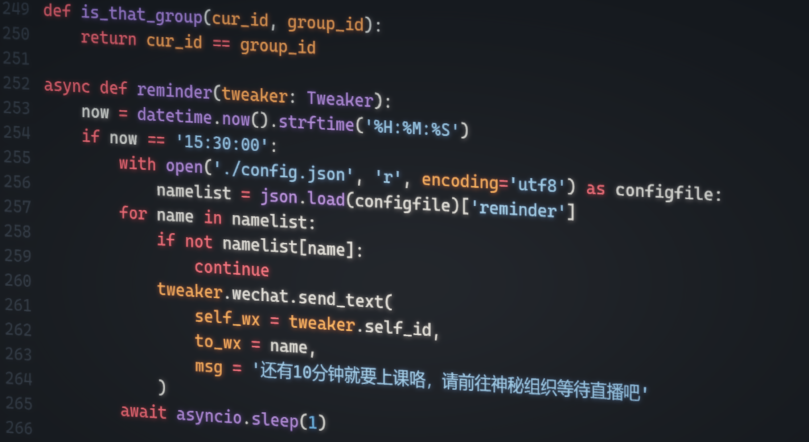

# 网课共享项目

## 项目初衷

让所有人都能上得起网课: )

## 项目原理

利用微信视频号提供的直播服务，转播付费在线网课。

## 项目功能

1. 低延迟同步课堂直播
2. 报名成员可参与课堂互动
3. 可观看课堂回放
4. 群聊机器人服务

## 项目架构

## 项目影响

截止至2023.1.28，”共享XX国际视野课程“项目的实际报名人数达29人，每人仅需34元，比原价每人999元便宜了接近28倍。倘若这29人全部通过正常渠道购买网课，总价高达28971元。根据这一数据，该项目使“XX国际视野课程”损失了27972元。

但如果没有这个项目，这29人是否都会去报名该课程？我想答案是否定的。在价格、自控力、假期活动等因素的共同作用下，同学们报名该课程的欲望值会很低。该项目正是极大地降低了价格的影响作用，使得同学们的欲望值提高。因此，作用因素不同，就无法说明该项目造成原网课的利益受损。

## 渲染图

帅吧？

